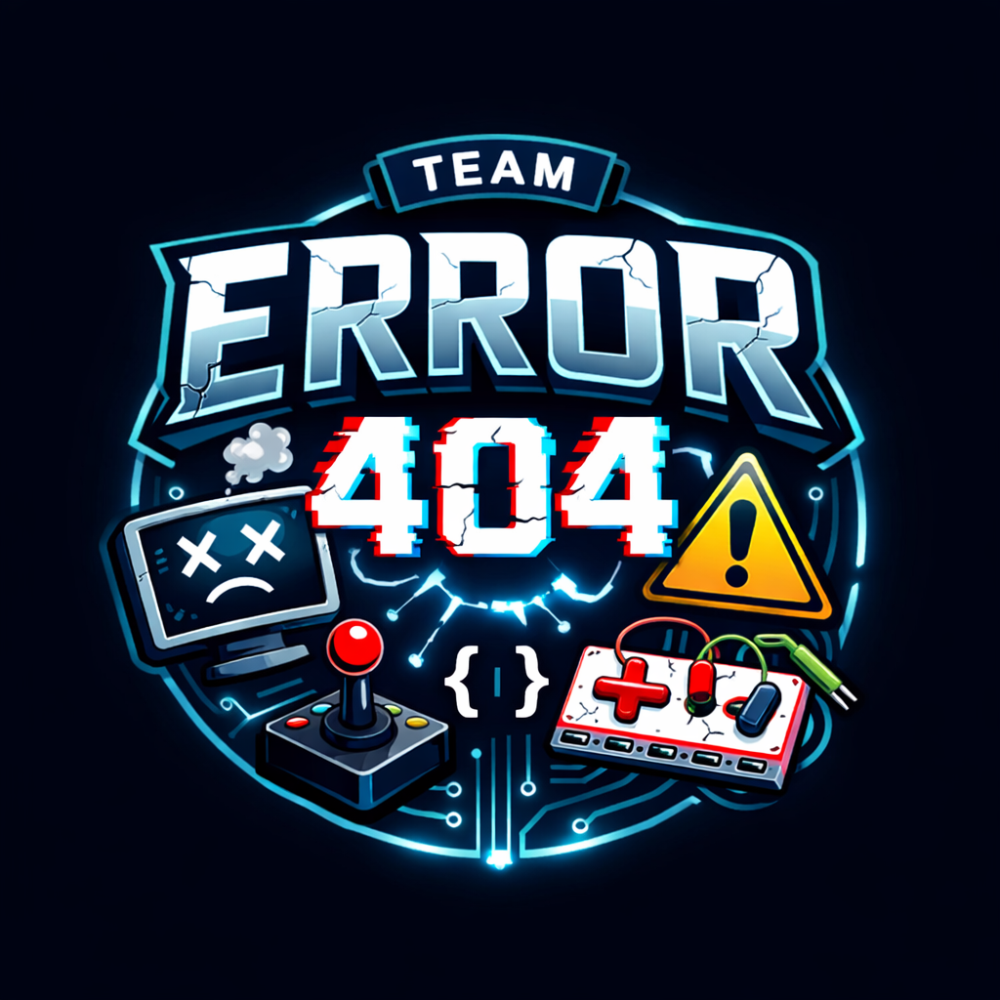
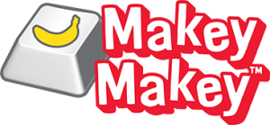

<!-- height or width of logo may be adjusted -->
<!-- This section is where you will replace the link to your transparent logo, the title of your project, and the very short desciptor of your project -->
<!-- If you used Canva to make your icon and don't want to pay for a background remover, you can use the website https://www.remove.bg/ to do so -->

  
  <h1 align="center">Escape the Code Lab: A Game that Emphasizes the Importance of Parameters, Return Types, and Cybersecurity</h1>
  
A project for students 11+ by Error 404: Team Name Not Found 

<!-- the emojis are not set in stone! If you'd like you can remove them entirely or select your own from https://gist.github.com/rxaviers/7360908 you are welcome to -->

## :loudspeaker: About
The objective of the workshop is to teach the fundamentals of Java programming and the importance of cybersecurity.
<!-- You can look at other TAP projects if you need a better idea of how to describe your workshops objectives -->

This workshop has participants do a few basic methods in a Processing sketch and see the game itself using Makey-Makey and Play-Doh as a controller.

## :bulb: Project Information
<!-- 
Your Options for target audience: 
  - High School
  - College
  - Middle School
  - K-12
  - Non-Stem
  - Undergraduate
You can select from a range of audiences or a single auidience. Examples: 
    Middle School - College 
    High School - College
    K-12
  You will be presenting most often to your peers who are taking introductory technology classes, so more often than not you should be including college in your target audience range. 
-->
* <b>Difficulty Level:</b> Beginner
* <b>Target Audience:</b> Grade 6 - College
* <b>Duration of Workshop:</b> 90 minutes
* <b>Needed Materials:</b> Computer with keyboard and USB port, Makey-Makey kit
* <b>Learning Outcomes:</b> The primary goal of this project is to teach participants the importance of parameters and return types as well as the basics of cybersecurity.
* <b>Your Main Technology</b> Processing - a sketch structure for combining classes and methods; Makey-Makey - an interactive element that turns any conductor into an input 
* [Technology Ambassador Program](https://tapggc.org/) <b>(TAP)</b> is a project-based class that provides a collaborative environment for students to work with their fellow classmates on a semester-long project using technologies of their choice. TAP strives to increase participation in IT through numerous outreach activities and workshops that are designed to showcase the creative and fun side of technology.
<!-- Commercial Video stored in the Media folder will be linked here -->

[Commercial Video](https://github.com/TAP-GGC/NinjaTurtles/assets/157164928/94b037a6-8912-44da-8a8c-84c0b8a0afb8)

<!-- videos can also be dragged and dropped into markdown files if you want them embedded -->

## :pencil2: Team: Error 404: Team Name Not Found

<!-- Use the team photo of your choice once youve uploaded it to the team photo folder within the media folder -->

> (From left to right: Zara Nazari,  Tuan Nguyen, Jake Sargent.)
<!-- replace with full names of your team members -->

* Tuan Nguyen
* Zara Nazari
* Jake Sargent

## :mortar_board: Advisors
<!-- name of the two professors overseeing your TAP class -->
* Dr. Wei Jin
* Dr. Xin Xu

## :page_with_curl: Project Description
This workshop will show you how to install and run Processing and set up Makey-Makey to use any conductor as a controller. Our goal is to teach the basics of what every function in a project does and the importance of protecting oneself against cybersecurity threats. You will create your own basic functions in a Processing sketch and play the game using the peripheral hardware provided.

## :open_hands: Outreach
1. <b>TAP Expo </b>, March 5, 2026, Georgia Gwinnett College: to promote the IT field and encourage college students to sign up for TAP.
2. <b>Atlanta Science Festival </b>, March 7, 2026, Georgia Gwinnett College: to demonstrate our project and garner interest in the IT field.
3. <b>Class Workshops </b>, April 6-10, 2026, Georgia Gwinnett College: to promote the IT field to non-IT students.
4. <b>Super Saturday </b>, April 18, 2026, Georgia Gwinnett College: to promote various scientific and IT fields to younger students still exploring interests.
5. <b>Norcross Innovation Showcase </b>, April 25, 2026, Lillian Webb Park: to promote the IT field to attendees.

## :computer: Technology
<i> Replace Scratch with whatever technology you're using and make sure to have a logo of that technology uploaded to the technology folder within the media folder. </i>
<!-- be sure to use the alt text feature in case anybody viewing your repo is using  screen reader! you want your workshop to be as accessible as possible -->

  
  

* [Processing](https://processing.org/) is a sketch-based platform for coding in a way that gives extra support to classes.
* The sketch tab tracks the display elements of your program while all the business classes are run behind the scenes in separate tabs.
* [Makey-Makey](https://makeymakey.com/) is a hardware kit that turns anything you can think of that conducts electricity into a controller for your game or other program. By connecting your controller objects to the circuit board and the board to the computer, you can add an extra fun element to anything you run.
* We chose this technology because it was easiest to pick up and adapt to our needs and to add an interactive layer to running the game itself.

## Project Setup/Installation

### Setting up Makey-Makey
[What you will need: Makey-Makey kit, Velcro wrist strap peripheral, five conductive objects (fruits, aluminum foil, Play-Doh, etc.)]  

1. Plug the USB-A end of the larger red cable into your computer's USB port.
2. Plug the opposite end into the circuit board's covered port on the top right.
3. Take five short white wires from the bag and plug one end of each into each of the W, A, S, D, and F slots in the black box on the left side of the circuit board.
4. Take six alligator clip wires from the box and clamp five of them onto the free ends of the short white wires. Arrange the opposite ends as you like.
5. Clamp the sixth alligator clip through a hole on the bottom right side of the board. Clamp the opposite end onto the clip end of the Velcro wrist strap's wire.
6. Wrap the strap around either wrist and secure it to itself. Make sure that the metal sensor plate is firmly in direct contact with your skin.
7. Plug the open ends of the W, A, S, D, and F alligator clips into your conductive objects to use as your controller inputs.

<!-- if your project uses scratch, you can reuse any of these instructions (be sure to include CS First alternatives) -->
## Processing Installation Walkthrough

1. Go to processing.org
2. Click the blue "Download" button on the left side of the screen
3. You will be redirected to another page with a central button to download (you may scroll down to find options for alternate operating systems as well).
4. Click "Download Processing 4.5.2 for {OS}" and follow prompts to install.
5. Once it is installed, click the green "Code" button in GitHub followed by "Download ZIP."
6. Unzip the files in your computer's file storage and open in Processing.
7. Click the play button at the top of the window to run the code.

## Usage
1. Press your chosen A object to move to the left.
2. Press your chosen D object to move to the right.
3. Press your chosen W object to move up.
4. Press your chosen S object to move down.
5. Press your chosen F object to interact with the items that appear throughout the game.

## Short Demo Instructions 
[Demo Video on how to install and play our game](https://youtu.be/mA80Aa55t-U)

## Workshop Instructions 
[Click here to view workshop walkthrough pdf file](/documents/tutorial%20materials/Scratch%20Workshop%20Walkthrough.pdf)

[Our Game Workshop Video](https://youtu.be/Mtsre0iMStM)

